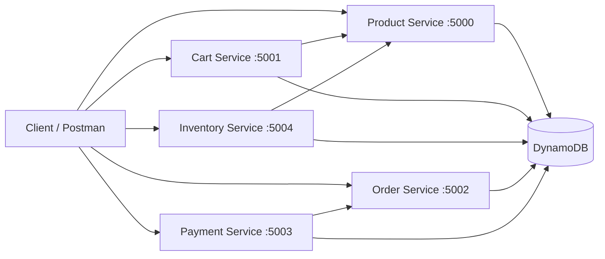

# E-Commerce App

Microservice-based e-commerce backend built with Node.js, Express, and AWS DynamoDB.

The project is split into independent services:

- Product Service
- Cart Service
- Inventory Service
- Order Service
- Payment Service

Each service can run locally with Express and can also be deployed as an AWS Lambda handler via `serverless-http`.

## Architecture



## Repository Structure

```text
E-Commerce App/
|- cart-service/
|- inventory-service/
|- order-service/
|- payment-service/
|- product-service/
|- CART_SERVICE_API_DOCS.md
`- README.md
```

## Service Map

| Service | Default Port | Base Route | Purpose |
|---|---:|---|---|
| Product | 5000 | `/api/products` | Product CRUD |
| Cart | 5001 | `/api/cart` | Add/update/remove customer cart items |
| Order | 5002 | `/api/orders` | Place orders from cart and manage order status |
| Payment | 5003 | `/api/payments` | Process and track payments/refunds |
| Inventory | 5004 | `/api/inventory` | Track stock and low-stock checks |

## Tech Stack

- Node.js (ES Modules)
- Express
- AWS SDK v3 + DynamoDB
- Nodemon (local dev)
- serverless-http (Lambda adapter)

## Prerequisites

- Node.js 18+
- npm
- AWS credentials with DynamoDB access
- Existing DynamoDB tables for each service

## Local Setup

### 1. Install dependencies

Run from repository root:

```powershell
cd cart-service; npm install
cd ../inventory-service; npm install
cd ../order-service; npm install
cd ../payment-service; npm install
cd ../product-service; npm install
cd ..
```

### 2. Create `.env` files

Create a `.env` in each service folder.

Use this common base:

```env
AWS_REGION=ap-southeast-2
AWS_PROFILE=default
AWS_SDK_LOAD_CONFIG=1
```

Then add service-specific values.

#### Product Service (`product-service/.env`)

```env
PORT=5000
DYNAMODB_TABLE=Products
AWS_REGION=ap-southeast-2
```

#### Cart Service (`cart-service/.env`)

```env
PORT=5001
CART_TABLE=Cart
PRODUCT_SERVICE_URL=http://localhost:5000
AWS_REGION=ap-southeast-2
```

#### Order Service (`order-service/.env`)

```env
PORT=5002
ORDER_TABLE=Orders
CART_TABLE=Cart
AWS_REGION=ap-southeast-2
```

#### Payment Service (`payment-service/.env`)

```env
PORT=5003
DYNAMODB_TABLE=Payments
ORDER_TABLE=Orders
AWS_REGION=ap-southeast-2
```

#### Inventory Service (`inventory-service/.env`)

```env
PORT=5004
INVENTORY_TABLE=Inventory
PRODUCT_SERVICE_URL=http://localhost:5000/api/products
AWS_REGION=ap-southeast-2
```

### 3. Start services (one terminal per service)

```powershell
cd product-service; npm run dev
```

```powershell
cd cart-service; npm run dev
```

```powershell
cd order-service; npm run dev
```

```powershell
cd payment-service; npm run dev
```

```powershell
cd inventory-service; npm run dev
```

## Health Checks

- Product: `GET http://localhost:5000/api/products`
- Cart root: `GET http://localhost:5001/`
- Cart health: `GET http://localhost:5001/api/cart/health`
- Order root: `GET http://localhost:5002/`
- Order health: `GET http://localhost:5002/api/orders/health`
- Payment root: `GET http://localhost:5003/`
- Inventory root: `GET http://localhost:5004/`
- Inventory health: `GET http://localhost:5004/api/inventory/health`

## Key API Endpoints

### Product Service

- `POST /api/products`
- `GET /api/products`
- `GET /api/products/:id`
- `PUT /api/products/:id`
- `DELETE /api/products/:id`

### Cart Service

- `POST /api/cart/:customerId`
- `GET /api/cart/:customerId`
- `PUT /api/cart/:customerId/:cartItemId`
- `DELETE /api/cart/:customerId/:cartItemId`
- `DELETE /api/cart/:customerId/cart/clear`

Full cart API details are in `CART_SERVICE_API_DOCS.md`.

### Inventory Service

- `POST /api/inventory`
- `GET /api/inventory`
- `GET /api/inventory/:productId`
- `PUT /api/inventory/:productId`
- `DELETE /api/inventory/:productId`
- `GET /api/inventory/low-stock`
- `GET /api/inventory/check/:productId`
- `PUT /api/inventory/reduce/:productId`
- `PUT /api/inventory/restore/:productId`

### Order Service

- `POST /api/orders/:customerId`
- `GET /api/orders/:customerId`
- `GET /api/orders/:customerId/:orderId`
- `PATCH /api/orders/:customerId/:orderId/cancel`
- `GET /api/orders/admin/all`
- `PATCH /api/orders/admin/:orderId/status`

### Payment Service

- `POST /api/payments`
- `GET /api/payments`
- `GET /api/payments/:paymentId`
- `GET /api/payments/order/:orderId`
- `PUT /api/payments/:paymentId/status`
- `PUT /api/payments/:paymentId/refund`

## Useful Scripts

- Run service locally: `npm run dev`
- Start in normal mode: `npm start`
- Seed product data: `cd product-service && npm run seed`
- Create Orders table helper: `cd order-service && node createTable.js`

## Lambda Notes

Each service has a `lambda.js` entry point that wraps the shared Express app:

- `cart-service/lambda.js`
- `inventory-service/lambda.js`
- `order-service/lambda.js`
- `payment-service/lambda.js`
- `product-service/lambda.js`

## Postman

- Collection: `Cart-Service-Postman.postman_collection.json`
- Detailed cart API docs: `CART_SERVICE_API_DOCS.md`

## Current Scope

This repository focuses on service-level business logic and DynamoDB integration.

Possible next improvements:

- Authentication and authorization
- API Gateway or service mesh style routing
- Docker-based local orchestration
- Automated tests for each service
- CI/CD for Lambda deployment


- sns and sqs implemented in this and notification with email also implemented
