# CloudBasket Enterprise Multi-Vendor E-Commerce Platform

[](https://github.com/dharineeshv/E-Commerce-Backend-API-s-IDP/actions)
[](https://sonarcloud.io/summary/new_code?id=dharineeshv_E-Commerce-Backend-API-s-IDP)
[](https://snyk.io/)
[](https://aws.amazon.com/)
[](https://nodejs.org/)

An enterprise-grade, event-driven, serverless multi-vendor e-commerce platform built on **Node.js (ES Modules)**, **AWS Lambda**, **Amazon API Gateway v1 (v1 REST API)**, **DynamoDB**, **AWS SNS/SQS**, **AWS Cognito + Google OAuth 2.0**, **Razorpay Payment Gateway**, **AWS X-Ray Tracing**, **CloudWatch Dashboards (Terraform IaC)**, **SonarQube Cloud**, and **Snyk Security**.

---

## 📑 Table of Contents

- [Architectural Overview](#-architectural-overview)
- [Microservices Ecosystem](#-microservices-ecosystem)
- [Event-Driven Async Workflows (SNS & SQS)](#-event-driven-async-workflows-sns--sqs)
- [Authentication & Identity (Cognito & Google OAuth)](#-authentication--identity-cognito--google-oauth)
- [Third-Party Integrations (Razorpay & Nodemailer)](#-third-party-integrations-razorpay--nodemailer)
- [Observability & Monitoring (X-Ray & CloudWatch)](#-observability--monitoring-x-ray--cloudwatch)
- [Infrastructure as Code (Terraform)](#-infrastructure-as-code-terraform)
- [CI/CD Pipeline & Code Quality (SonarQube & Snyk)](#-cicd-pipeline--code-quality-sonarqube--snyk)
- [Repository & File Directory Structure](#-repository--file-directory-structure)
- [API Gateway Routes & API Versioning](#-api-gateway-routes--api-versioning)
- [Frontend Web Application](#-frontend-web-application)
- [Local Development Setup](#-local-development-setup)
- [Deployment & Operational Scripts](#-deployment--operational-scripts)

---

## 🏗️ Architectural Overview

```mermaid
flowchart TD
    subgraph ClientLayer ["Client & Distribution Layer"]
        User[Browser Client / SPA]
        CDN[Amazon CloudFront CDN]
        User -->|HTTPS| CDN
        CDN -->|Static Content| S3Bucket[AWS S3 Frontend Bucket]
    end

    subgraph APILayer ["API Management & Auth"]
        APIGW[Amazon API Gateway v1 REST API /api/v1/*]
        Cognito[AWS Cognito User Pool]
        GoogleOAuth[Google OAuth 2.0 Provider]
        GoogleLinker[CloudBasketGoogleAccountLinker Lambda]
        
        CDN -->|API Requests| APIGW
        User -->|Auth Flow| Cognito
        Cognito <-->|Federated OAuth| GoogleOAuth
        Cognito -->|Pre-Token Trigger| GoogleLinker
        APIGW -->|Cognito Authorizer| Cognito
    end

    subgraph Microservices ["Backend Microservices (AWS Lambda)"]
        AuthSvc[authentication-service]
        CartSvc[cart-service]
        InventorySvc[inventory-service]
        MarketingSvc[marketing-service]
        NotifSvc[notification-service]
        OrderSvc[order-service]
        PaymentSvc[payment-service]
        ProductSvc[product-service]
        ReviewSvc[review-service]
        ProfileSvc[user-profile-service]
        WishlistSvc[wishlist-service]

        APIGW --> AuthSvc
        APIGW --> CartSvc
        APIGW --> InventorySvc
        APIGW --> MarketingSvc
        APIGW --> OrderSvc
        APIGW --> PaymentSvc
        APIGW --> ProductSvc
        APIGW --> ReviewSvc
        APIGW --> ProfileSvc
        APIGW --> WishlistSvc
    end

    subgraph Persistence ["Persistence & Storage"]
        DDB[(Amazon DynamoDB Tables)]
        S3Prod[AWS S3 Product Images Bucket]
        
        AuthSvc & CartSvc & InventorySvc & MarketingSvc & OrderSvc & PaymentSvc & ProductSvc & ReviewSvc & ProfileSvc & WishlistSvc --> DDB
        ProductSvc --> S3Prod
    end

    subgraph EventBus ["Event-Driven Messaging System"]
        SNSTopic[AWS SNS Event Bus Topic]
        SQS_Inv[SQS Inventory Queue]
        SQS_Ord[SQS Order Queue]
        SQS_Notif[SQS Notification Queue]

        OrderSvc -->|ORDER_PLACED / CANCELLED| SNSTopic
        PaymentSvc -->|PAYMENT_SUCCESS / REFUNDED| SNSTopic
        
        SNSTopic --> SQS_Inv
        SNSTopic --> SQS_Ord
        SNSTopic --> SQS_Notif

        SQS_Inv --> InventorySvc
        SQS_Ord --> OrderSvc
        SQS_Notif --> NotifSvc
        NotifSvc -->|SMTP Email| Gmail[Gmail Transactional Email]
    end

    subgraph Observability ["Observability & Monitoring"]
        XRay[AWS X-Ray Tracing]
        CW[Amazon CloudWatch Dashboards & Alarms]
        
        Microservices -.->|Subsegment Traces| XRay
        Microservices -.->|Metrics & Logs| CW
    end
```



---

## ⚙️ Microservices Ecosystem

The backend is architected into **11 decoupled serverless microservices**, located inside the `backend/` directory. Each microservice is containerized via `serverless-http` and deployed as an independent AWS Lambda function:

| Microservice | Base Route | Database Table | Responsibility |
|---|---|---|---|
| **`authentication-service`** | `/api/v1/auth` | N/A (Cognito) | AWS Cognito token authentication, Secret Hash calculation & session verification |
| **`cart-service`** | `/api/v1/cart` | `Dharineesh_cart` | Add, update, remove items, cart total calculation, item quantity management |
| **`inventory-service`** | `/api/v1/inventory` | `Dharineesh_inventory` | Stock tracking, low-stock threshold monitoring, automatic deduction & restoration |
| **`marketing-service`** | `/api/v1/marketing` | `Dharineesh_coupons` | Festival sale banners, discount coupons, percentage promo calculations |
| **`notification-service`** | `/api/v1/notifications` | N/A | SQS consumer sending transactional HTML emails via Nodemailer + Gmail SMTP |
| **`order-service`** | `/api/v1/order` | `Dharineesh_orders` | Order creation, state engine (Pending/Confirmed/Shipped/Delivered/Cancelled), PDF invoices |
| **`payment-service`** | `/api/v1/payments` | `Dharineesh_payments` | Razorpay payment creation, Webhook validation, UPI & Cash on Delivery (COD) processing |
| **`product-service`** | `/api/v1/products` | `Dharineesh_products` | Product catalog CRUD, S3 image uploads, CloudFront CDN integration, product search |
| **`review-service`** | `/api/v1/reviews` | `Dharineesh_reviews` | Customer ratings, reviews submission, average rating aggregation, user-scoped deletion |
| **`user-profile-service`** | `/api/v1/user-profile` | `Dharineesh_user_profiles` | User profile management, delivery address storage, customer metadata |
| **`wishlist-service`** | `/api/v1/wishlist` | `Dharineesh_wishlists` | Customer wishlist management, item toggling, product bookmarking |

---

## 📩 Event-Driven Async Workflows (SNS & SQS)

The system utilizes an asynchronous event-driven architecture powered by **Amazon SNS** and **Amazon SQS** to guarantee eventual consistency and fault tolerance without blocking HTTP API requests.

### Event Publishers (SNS)
Microservices publish domain events to the primary SNS Event Bus Topic (`Dharineesh_ECommerce_Topic`):

| Publisher Service | Event Type | Trigger Condition |
|---|---|---|
| **Order Service** | `ORDER_PLACED` | Customer completes checkout and places a new order |
| **Order Service** | `ORDER_CANCELLED` | Customer cancels a PENDING order before shipment |
| **Payment Service** | `PAYMENT_SUCCESS` | Online payment (Razorpay/UPI) is verified successfully |
| **Payment Service** | `PAYMENT_PENDING` | Cash on Delivery (COD) order placed |
| **Payment Service** | `PAYMENT_REFUNDED` | Refund issued for a cancelled order |

### Event Consumers (SQS)
Each consuming microservice listens to its dedicated SQS Queue subscribed to the SNS Topic:

| Consumer Service | Queue Name | Consumed Events | Business Action |
|---|---|---|---|
| **Inventory Service** | `InventoryQueue` | `ORDER_PLACED`, `ORDER_CANCELLED` | Reduces stock on `ORDER_PLACED`; restores stock on `ORDER_CANCELLED` |
| **Order Service** | `OrderQueue` | `PAYMENT_SUCCESS`, `PAYMENT_PENDING`, `PAYMENT_REFUNDED` | Automatically updates order status state machine (`CONFIRMED`, `REFUNDED`) |
| **Notification Service** | `NotificationQueue` | All 5 Events | Sends custom HTML emails to customer and BCC to store owner |

---

## 🔐 Authentication & Identity (Cognito & Google OAuth)

1. **AWS Cognito User Pool**: Handles customer registration, sign-in, MFA verification, and JWT token issuance (ID Token, Access Token, Refresh Token).
2. **Google OAuth 2.0 Integration**: Supports social sign-in via Google Accounts.
3. **`CloudBasketGoogleAccountLinker`**: Dedicated Lambda function executing as a Cognito **Pre-Token Generation Trigger** to link Google OAuth accounts with existing email profiles seamlessly.
4. **Role-Based Access Control (RBAC)**: Enforces strict route permissions (`ADMIN` vs `CUSTOMER`) across microservices using custom middleware (`cognitoAuthMiddleware.js`, `authorizeRoles.js`).

---

## 💳 Third-Party Integrations (Razorpay & Nodemailer)

- **Razorpay Gateway**: Integrated into `payment-service` for processing online credit/debit card, net banking, and UPI transactions with cryptographic SHA-256 signature verification.
- **Transactional Emails**: `notification-service` uses **Nodemailer** with Gmail SMTP transport to deliver branded HTML email confirmations for orders, cancellations, and payment receipts.

---

## 📊 Observability & Monitoring (X-Ray & CloudWatch)

1. **AWS X-Ray Distributed Tracing**:
   - Instrumented across all microservices using `aws-xray-sdk` and `@aws-sdk/client-*` subsegment tracing.
   - Captures end-to-end trace maps, HTTP latency breakdown, and DynamoDB query performance.
2. **Amazon CloudWatch Dashboards**:
   - Custom operational dashboards tracking API Gateway 4xx/5xx error rates, Lambda execution durations, SQS queue depth, and CloudFront CDN cache hit ratios.

---

## 🛠️ Infrastructure as Code (Terraform)

Infrastructure elements are declaratively managed using **Terraform (HCL)** located under `terraform/`:

- **`main.tf`**: AWS Provider configuration (`ap-southeast-1`).
- **`dashboards.tf`**: Automated provisioning of CloudWatch operational dashboards and metric alarms.
- **`variables.tf` / `outputs.tf`**: Parameterized inputs and resource ARN outputs.

```bash
cd terraform
terraform init
terraform plan
terraform apply
```

---

## 🚀 CI/CD Pipeline & Code Quality (SonarQube & Snyk)

Automated continuous integration and deployment is managed via **GitHub Actions** (`.github/workflows/ci-cd.yml`):

1. **Automated Testing**: Runs unit test suites for frontend utilities and backend microservices using Node's built-in test runner (`node --test`).
2. **Snyk Vulnerability Scan**: Scans project dependencies for known security vulnerabilities.
3. **SonarQube Cloud Analysis**: Performs static code analysis, tracking maintainability, reliability, and security hotspots based on `sonar-project.properties`.
4. **AWS S3 Sync & CloudFront Invalidation**: Syncs updated static frontend files to S3 buckets (`cloudbasket-frontend`, `dharineesh-frontend`) and invalidates CloudFront CDN caches.
5. **AWS Lambda Packaging & Deployment**: Zips microservices and deploys code updates using `upload_lambdas.mjs`.

---

## 📁 Repository & File Directory Structure

```text
E-Commerce App/
├── 🌐 CloudBasket-Frontend/           <-- Web Application (HTML5, Vanilla CSS, JS ES6+)
│   ├── assets/                          <-- Brand logos, UI assets & media
│   ├── components/                      <-- Reusable UI components & Chatbot
│   ├── css/                             <-- Styling & Design tokens
│   ├── js/                              <-- Frontend Application & API Controllers
│   │   ├── api/                         <-- API clients (apiClient, productApi, reviewApi, etc.)
│   │   └── utils/                       <-- Helper utilities & modals
│   ├── pages/                           <-- Sub-pages (Dashboard, Orders, Admin)
│   ├── test/                            <-- Frontend Unit Test Suites
│   ├── index.html                       <-- Main E-Commerce Storefront
│   ├── cart.html                        <-- Shopping Cart Page
│   ├── checkout.html                    <-- Secure Checkout & Payment Page
│   ├── login.html                       <-- User Login Page
│   ├── order-details.html               <-- Order Details & PDF Invoice Download
│   ├── orders.html                      <-- Customer Order History & Delivery Tracker
│   ├── payment-success.html             <-- Order Confirmation Page
│   ├── product.html                     <-- Product Details & Review Management
│   ├── register.html                    <-- Customer Registration Page
│   ├── verify-email.html                <-- Email Verification Page
│   └── wishlist.html                    <-- Customer Wishlist Page
│
├── ⚙️ backend/                        <-- Microservices Source Code
│   ├── authentication-service/          <-- Cognito Auth Service
│   ├── cart-service/                    <-- Shopping Cart Service
│   ├── inventory-service/               <-- Inventory & Stock Service
│   ├── marketing-service/               <-- Promotional Coupons & Sales Service
│   ├── notification-service/            <-- Email Notification SQS Service
│   ├── order-service/                   <-- Order Processing & State Engine
│   ├── payment-service/                 <-- Razorpay & UPI Payment Service
│   ├── product-service/                 <-- Product Catalog & S3 Upload Service
│   ├── review-service/                  <-- Customer Ratings & Review Service
│   ├── user-profile-service/            <-- Customer Profile & Address Service
│   └── wishlist-service/                <-- Wishlist Persistence Service
│
├── ☁️ terraform/                        <-- Infrastructure as Code (CloudWatch Dashboards)
├── 🔄 .github/workflows/ci-cd.yml       <-- GitHub Actions Deployment Pipeline
├── upload_lambdas.mjs                   <-- Automated AWS Lambda Packaging & Deployment Script
├── sonar-project.properties             <-- SonarQube Cloud Scanner Configuration
├── CART_SERVICE_API_DOCS.md             <-- Microservices API Documentation
└── README.md                            <-- Platform Documentation
```

---

## 🌐 API Gateway Routes & API Versioning

All API Gateway endpoints are standardized under `/api/v1/`:

| Path Prefix | Service | Key Endpoints |
|---|---|---|
| `/api/v1/auth` | Authentication | `POST /register`, `POST /login`, `POST /verify` |
| `/api/v1/cart` | Cart | `GET /`, `POST /`, `PUT /:itemId`, `DELETE /:itemId` |
| `/api/v1/inventory` | Inventory | `GET /`, `GET /:productId`, `PUT /reduce/:productId`, `PUT /restore/:productId` |
| `/api/v1/marketing` | Marketing | `GET /coupons`, `GET /active-sale`, `POST /apply-coupon` |
| `/api/v1/order` | Order | `POST /`, `GET /:customerId`, `GET /:customerId/:orderId`, `PATCH /:orderId/cancel` |
| `/api/v1/payments` | Payment | `POST /create-razorpay-order`, `POST /verify-razorpay`, `POST /cod` |
| `/api/v1/products` | Product | `GET /`, `GET /:id`, `POST /` (Admin), `PUT /:id` (Admin), `DELETE /:id` (Admin) |
| `/api/v1/reviews` | Review | `GET /product/:productId`, `POST /`, `DELETE /:reviewId` |
| `/api/v1/user-profile` | Profile | `GET /:customerId`, `PUT /:customerId` |
| `/api/v1/wishlist` | Wishlist | `GET /:customerId`, `POST /`, `DELETE /:customerId/:productId` |

---

## 🖥️ Frontend Web Application

The frontend is a vanilla JavaScript (ES6+ Modules) application styled with custom CSS token systems and micro-animations:

- **Storefront & Search**: Dynamic product filtering, category navigation, live search, festival sale banners.
- **Interactive Reviews**: Product star ratings, review submission modal, user-scoped deletion buttons.
- **Delivery Tracker**: Visual multi-step progress bar (`Pending` ➔ `Confirmed` ➔ `Shipped` ➔ `Delivered` / `Cancelled`).
- **PDF Invoices**: Browser-side PDF generation for download.
- **Floating AI Chatbot**: Floating assistant widget embedded across storefront pages.

---

## 💻 Local Development Setup

### 1. Prerequisites
- **Node.js**: `v20.0.0` or higher
- **AWS CLI**: Configured with valid credentials (`aws configure`)
- **Git**: Installed

### 2. Installation
Clone the repository and install dependencies inside any microservice directory:

```bash
# Navigate to desired microservice
cd backend/product-service
npm install

# Run unit tests locally
npm test
```

### 3. Run Microservices Locally
```bash
# Run Product Service locally on port 5000
cd backend/product-service
npm start
```

---

## 📜 Deployment & Operational Scripts

| Script | Purpose |
|---|---|
| **`upload_lambdas.mjs`** | Packages all 11 microservices into ZIP archives and deploys directly to AWS Lambda using AWS CLI commands. |
| **`create_comprehensive_dashboard.mjs`** | Generates CloudWatch operational metric dashboards for API Gateway and Lambda executions. |
| **`create_cloudfront_monitoring_dashboard.mjs`** | Creates CloudWatch latency and cache hit monitoring dashboards for CloudFront CDN. |

---

## 📄 License & Attribution

Copyright © 2026 **CloudBasket Team**. All rights reserved.