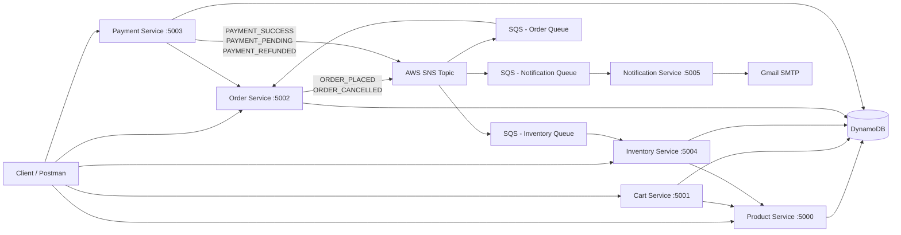

# E-Commerce App

Microservice-based e-commerce backend built with Node.js, Express, and AWS (DynamoDB + SNS + SQS).

Each service runs independently with Express locally and deploys as an AWS Lambda function via `serverless-http`.

---

## Services

| Service | Port | Base Route | Purpose |
|---|---:|---|---|
| Product | 5000 | `/api/products` | Product CRUD |
| Cart | 5001 | `/api/cart` | Manage customer cart items |
| Order | 5002 | `/api/orders` | Place orders, manage order lifecycle |
| Payment | 5003 | `/api/payments` | Process payments and refunds |
| Inventory | 5004 | `/api/inventory` | Track stock levels |
| Notification | 5005 | `/api/notifications` | Send transactional emails via Gmail SMTP |

---

## Architecture



---

## Event-Driven Flow

### SNS Publishers

| Service | Event Published | Trigger |
|---|---|---|
| Order | `ORDER_PLACED` | Customer places an order |
| Order | `ORDER_CANCELLED` | Customer cancels a PENDING order |
| Payment | `PAYMENT_SUCCESS` | UPI payment processed |
| Payment | `PAYMENT_PENDING` | COD payment created |
| Payment | `PAYMENT_REFUNDED` | Refund applied to a SUCCESS payment |

### SQS Consumers

| Service | Events Consumed | Action |
|---|---|---|
| Inventory | `ORDER_PLACED` | Reduces stock per item |
| Inventory | `ORDER_CANCELLED` | Restores stock per item |
| Order | `PAYMENT_SUCCESS` | Updates order status → `CONFIRMED` |
| Order | `PAYMENT_PENDING` | Updates order status → `PAYMENT_PENDING` |
| Order | `PAYMENT_REFUNDED` | Updates order status → `REFUNDED` |
| Notification | All 5 events above | Sends email to customer + store owner copy |

### SNS → SQS Envelope Format

All events follow this structure published to SNS:

```json
{
  "eventType": "ORDER_PLACED",
  "payload": { ... }
}
```

SQS receives this wrapped in an SNS envelope. Each Lambda consumer parses it as:

```js
const snsEnvelope = JSON.parse(record.body);
const businessEvent = JSON.parse(snsEnvelope.Message);
// businessEvent = { eventType, payload }
```

---

## Repository Structure

```text
E-Commerce App/
├── cart-service/
├── inventory-service/
│   └── src/handlers/inventoryEventHandler.js   ← SQS consumer
├── notification-service/
│   └── src/handlers/
│       ├── sqsHandler.js                        ← SQS record parser
│       └── notificationEventHandler.js          ← email dispatcher
├── order-service/
│   └── src/handlers/orderEventHandler.js        ← SQS consumer
├── payment-service/
│   └── src/services/snsService.js               ← SNS publisher
├── product-service/
├── CART_SERVICE_API_DOCS.md
└── README.md
```

---

## Tech Stack

- Node.js 18+ (ES Modules)
- Express 5
- AWS SDK v3 — DynamoDB, SNS
- AWS SQS (Lambda trigger)
- Nodemailer + Gmail SMTP (email notifications)
- serverless-http (Lambda adapter)
- Nodemon (local dev)

---

## Prerequisites

- Node.js 18+
- npm
- AWS credentials with DynamoDB and SNS access
- Existing DynamoDB tables per service
- An SNS topic with SQS queues subscribed (Inventory, Order, Notification)
- Gmail account with an App Password for the Notification Service

---

## Local Setup

### 1. Install dependencies

Run from the repository root:

```powershell
cd cart-service; npm install
cd ../inventory-service; npm install
cd ../order-service; npm install
cd ../payment-service; npm install
cd ../product-service; npm install
cd ../notification-service; npm install
cd ..
```

### 2. Create `.env` files

#### Common base (add to every service)

```env
AWS_REGION=ap-southeast-1
AWS_PROFILE=default
AWS_SDK_LOAD_CONFIG=1
```

#### Product Service — `product-service/.env`

```env
PORT=5000
DYNAMODB_TABLE=Products
AWS_REGION=ap-southeast-1
```

#### Cart Service — `cart-service/.env`

```env
PORT=5001
CART_TABLE=Cart
PRODUCT_SERVICE_URL=http://localhost:5000
AWS_REGION=ap-southeast-1
```

#### Order Service — `order-service/.env`

```env
PORT=5002
ORDER_TABLE=Orders
CART_TABLE=Cart
SNS_TOPIC_ARN=arn:aws:sns:<region>:<account-id>:<topic-name>
AWS_REGION=ap-southeast-1
```

#### Payment Service — `payment-service/.env`

```env
PORT=5003
DYNAMODB_TABLE=Payments
ORDER_TABLE=Orders
SNS_TOPIC_ARN=arn:aws:sns:<region>:<account-id>:<topic-name>
AWS_REGION=ap-southeast-1
```

#### Inventory Service — `inventory-service/.env`

```env
PORT=5004
INVENTORY_TABLE=Inventory
PRODUCT_SERVICE_URL=http://localhost:5000/api/products
AWS_REGION=ap-southeast-1
```

#### Notification Service — `notification-service/.env`

```env
PORT=5005
GMAIL_EMAIL=<your-gmail-address>
GMAIL_APP_PASSWORD=<your-gmail-app-password>
STORE_OWNER_EMAIL=<store-owner-email>
```

### 3. Start services (one terminal per service)

```powershell
cd product-service; npm run dev
```

```powershell
cd cart-service; npm run dev
```

```powershell
cd order-service; npm run dev
```

```powershell
cd payment-service; npm run dev
```

```powershell
cd inventory-service; npm run dev
```

```powershell
cd notification-service; npm run dev
```

---

## Health Checks

| Service | URL |
|---|---|
| Product | `GET http://localhost:5000/api/products` |
| Cart | `GET http://localhost:5001/api/cart/health` |
| Order | `GET http://localhost:5002/api/orders/health` |
| Payment | `GET http://localhost:5003/` |
| Inventory | `GET http://localhost:5004/api/inventory/health` |
| Notification | `GET http://localhost:5005/` |

---

## API Endpoints

### Product Service

| Method | Route | Description |
|---|---|---|
| `POST` | `/api/products` | Create a product |
| `GET` | `/api/products` | List all products |
| `GET` | `/api/products/:id` | Get product by ID |
| `PUT` | `/api/products/:id` | Update a product |
| `DELETE` | `/api/products/:id` | Delete a product |

### Cart Service

| Method | Route | Description |
|---|---|---|
| `POST` | `/api/cart/:customerId` | Add item to cart |
| `GET` | `/api/cart/:customerId` | Get customer cart |
| `PUT` | `/api/cart/:customerId/:cartItemId` | Update cart item |
| `DELETE` | `/api/cart/:customerId/:cartItemId` | Remove cart item |
| `DELETE` | `/api/cart/:customerId/cart/clear` | Clear entire cart |

Full details in `CART_SERVICE_API_DOCS.md`.

### Order Service

| Method | Route | Description |
|---|---|---|
| `POST` | `/api/orders/:customerId` | Place order from cart |
| `GET` | `/api/orders/:customerId` | Get all orders for customer |
| `GET` | `/api/orders/:customerId/:orderId` | Get specific order |
| `PATCH` | `/api/orders/:customerId/:orderId/cancel` | Cancel a PENDING order |
| `GET` | `/api/orders/admin/all` | List all orders (admin) |
| `PATCH` | `/api/orders/admin/:orderId/status` | Update order status (admin) |

### Order Status Lifecycle

```
PENDING → CONFIRMED → SHIPPED → DELIVERED
       ↘ CANCELLED
       ↘ PAYMENT_PENDING
       ↘ REFUNDED
```

Status transitions driven by payment events are automatic via SQS.

### Payment Service

| Method | Route | Description |
|---|---|---|
| `POST` | `/api/payments` | Process a payment (UPI or COD) |
| `GET` | `/api/payments` | List all payments |
| `GET` | `/api/payments/:paymentId` | Get payment by ID |
| `GET` | `/api/payments/order/:orderId` | Get payment by order ID |
| `PUT` | `/api/payments/:paymentId/status` | Update payment status |
| `PUT` | `/api/payments/:paymentId/refund` | Refund a SUCCESS payment |

### Inventory Service

| Method | Route | Description |
|---|---|---|
| `POST` | `/api/inventory` | Create inventory record |
| `GET` | `/api/inventory` | List all inventory |
| `GET` | `/api/inventory/:productId` | Get inventory by product |
| `PUT` | `/api/inventory/:productId` | Update inventory |
| `DELETE` | `/api/inventory/:productId` | Delete inventory record |
| `GET` | `/api/inventory/low-stock` | List low stock items |
| `GET` | `/api/inventory/check/:productId` | Check stock for a product |
| `PUT` | `/api/inventory/reduce/:productId` | Reduce stock manually |
| `PUT` | `/api/inventory/restore/:productId` | Restore stock manually |

---

## Lambda Entry Points

Each service has a `lambda.js` that handles both API Gateway and SQS triggers:

| Service | SQS Consumer | Behaviour |
|---|---|---|
| `product-service/lambda.js` | No | API Gateway only |
| `cart-service/lambda.js` | No | API Gateway only |
| `order-service/lambda.js` | Yes | Routes SQS → `orderEventHandler.js`, API Gateway → Express |
| `payment-service/lambda.js` | No | API Gateway only |
| `inventory-service/lambda.js` | Yes | Routes SQS → `inventoryEventHandler.js`, API Gateway → Express |
| `notification-service/lambda.js` | Yes | Routes SQS → `sqsHandler.js`, API Gateway → Express |

---

## Notification Service

The Notification Service is a pure SQS consumer. It has no DynamoDB dependency.

**Email templates implemented:**

| Event | Email Sent |
|---|---|
| `ORDER_PLACED` | Order confirmation to customer |
| `ORDER_CANCELLED` | Cancellation notice to customer |
| `PAYMENT_SUCCESS` | Payment confirmed to customer |
| `PAYMENT_PENDING` | COD payment pending notice to customer |
| `PAYMENT_REFUNDED` | Refund confirmation to customer |

Every email is also copied to `STORE_OWNER_EMAIL`.

**Transport:** Gmail SMTP via Nodemailer using a Gmail App Password.

---

## Useful Scripts

```powershell
# Run any service locally
npm run dev

# Start without nodemon
npm start

# Seed product data
cd product-service

# Create Orders DynamoDB table
cd order-service; node createTable.js
```

---


- till now implemented upto verisoning